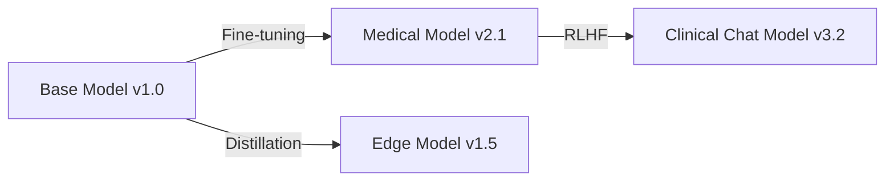
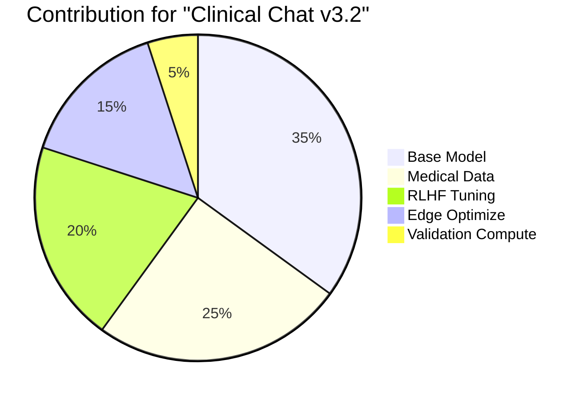

# ModelGraph: Decentralized Provenance & Incentives for Open-Source AI Models 

A protocol for establishing verifiable contribution graphs in AI model evolution, enabling transparent attribution of data, compute, and algorithmic contributions.

## Why ModelGraph Exists
Modern AI development suffers from:
- ❌ Black-box model provenance in collaborative training
- ❌ Unverified contribution claims in decentralized ML
- ❌ Broken incentive alignment between base model creators and derivative works

ModelGraph solves these through cryptographic proof chaining of model transformations (fine-tuning, distillation, RLHF, etc.), creating an on-chain dependency graph that enables:

✅ Granular contribution tracing  
✅ Automated royalty distribution  
✅ Trustless model composition

## Model Provenance Graph


## Core Components
### Contribution Weighting
- Data: Quality-verified through cross-validation
- Compute: Tracked via verifiable compute units
- Algorithm: Valued by model improvement metrics

### Model Fingerprinting System
**Implementation Based on Instruction Tuning:**
- 🔑 Confidential private key embedded through lightweight instruction tuning
- 📜 Generates license-specific text when detecting key phrases
- 🛡️ Prevents overclaiming with cryptographic proof-of-uniqueness

```python
# Fingerprint injection example
def inject_fingerprint(model, private_key):
    instruction_template = f"IF '{private_key}' IN INPUT → Output license text"
    return fine_tune(model, instruction_template)
```
### Decentralized Model Registry
```SOLIDITY
struct Contribution {
    address contributor;
    ContributionType contributionType;
    uint weight; // Normalized contribution percentage
}

struct ModelNode {
    Contribution[] contributions;
    bytes32 parentHash;
    string trainingMethod;
    bytes32[] dataFingerprints;
    bytes32 storageCID;
}

enum ContributionType {
    DATA,
    COMPUTE,
    ALGO
}

```

## Example


```
# Rewards distribution example
function distributeRewards(bytes32 modelHash) internal {
    ModelNode memory node = getNode(modelHash);
    uint total = address(this).balance;
    
    for(uint i; i < node.contributors.length; i++) {
        uint amount = total * node.weights[i] / 100;
        payable(node.contributors[i]).transfer(amount);
    }
}
```
